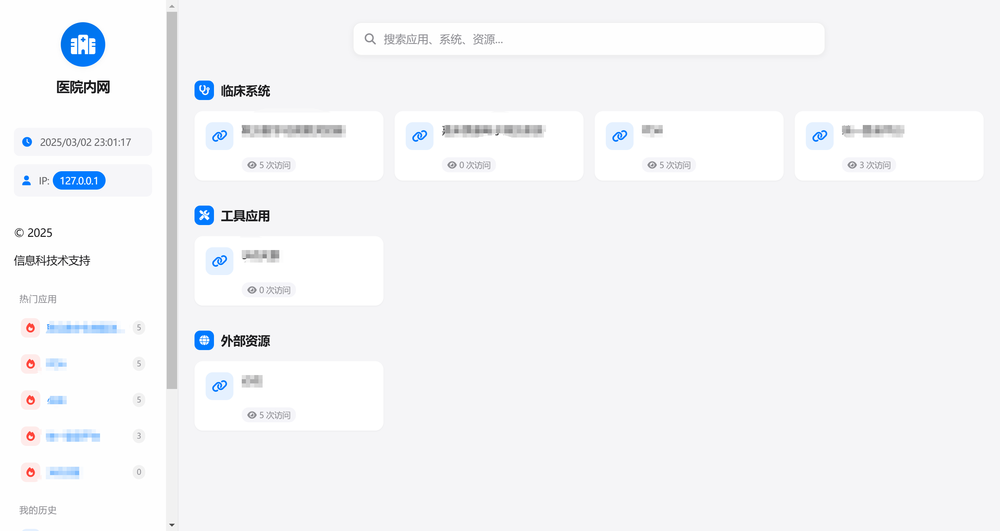

# 医院内网导航站

一个基于 Django 构建的医院内网导航系统，提供网站分类、搜索、下载统计等功能，采用苹果风格的现代界面设计。



## 核心功能

- 📱 响应式设计，完美适配桌面和移动设备
- 🔍 实时搜索功能，支持中文和拼音搜索
- 📊 应用点击量统计与展示
- 🔥 热门应用自动推荐
- 📚 支持网站分类管理
- 📥 文件下载功能
- 🕒 个人访问历史记录
- 🌓 自动深色模式支持

## 技术栈

- **后端**: Django 5.1+, Django Ninja API
- **前端**: HTML5, CSS3, JavaScript
- **样式**: Bootstrap 5, Font Awesome, 苹果风格设计
- **数据库**: SQLite (可替换为 PostgreSQL)
- **缓存**: Redis (可选)

## 项目结构

```
hospital-nav/
├── navsite/            # 项目核心配置
├── navigation/         # 主应用
│   ├── models.py       # 数据模型 (Category, Website, Shortcut等)
│   ├── api.py          # API 接口
│   ├── views.py        # 视图函数
│   ├── schemas.py      # API 模式
│   └── admin.py        # 管理界面配置
├── templates/          # HTML 模板
│   └── navigation/     # 导航相关模板
├── static/             # 静态文件
│   ├── css/            # CSS 样式
│   ├── js/             # JavaScript 脚本
│   └── img/            # 图片资源
├── media/              # 媒体文件
│   └── downloads/      # 下载文件存储
├── requirements.txt    # 项目依赖
└── .env.example        # 环境变量示例
```

## 安装与部署

### 本地开发环境

1. 克隆仓库

   ```bash
   git clone https://github.com/tengweiorg/hospital-nav.git
   cd hospital-nav
   ```

2. 创建虚拟环境

   ```bash
   python -m venv .venv
   source .venv/bin/activate  # Linux/Mac
   # 或
   .venv\Scripts\activate     # Windows
   ```

3. 安装依赖

   ```bash
   pip install -r requirements.txt
   ```

4. 准备环境变量

   ```bash
   cp .env.example .env
   # 编辑 .env 文件，设置必要的环境变量
   ```

5. 数据库迁移

   ```bash
   python manage.py migrate
   ```

6. 创建超级用户

   ```bash
   python manage.py createsuperuser
   ```

7. 运行开发服务器

   ```bash
   python manage.py runserver
   ```

8. 访问管理后台添加数据
   ```
   http://127.0.0.1:8000/admin/
   ```

### 生产环境部署

1. 设置生产环境变量

   ```
   # 在 .env 文件中
   SECRET_KEY=your-secret-key-here
   DEBUG=False
   ALLOWED_HOSTS=yourdomain.com,www.yourdomain.com
   ```

2. 使用 Gunicorn 运行应用

   ```bash
   gunicorn navsite.wsgi:application --bind 0.0.0.0:8000
   ```

3. 配置 Nginx 反向代理

   ```nginx
   server {
       listen 80;
       server_name yourdomain.com;

       location /static/ {
           alias /path/to/hospital-nav/staticfiles/;
       }

       location /media/ {
           alias /path/to/hospital-nav/media/;
       }

       location / {
           proxy_pass http://127.0.0.1:8000;
           proxy_set_header Host $host;
           proxy_set_header X-Real-IP $remote_addr;
       }
   }
   ```

## URL 路由结构

项目的主要 URL 路由定义在 `navsite/urls.py` 中：

```python
urlpatterns = [
    path('admin/', admin.site.urls),
    path('api/', api.urls),
    path('', TemplateView.as_view(template_name='navigation/index.html'), name='home'),
    re_path(r'^downloads/(?P<file_path>.+)$', download_file, name='download_file'),
]
```

### API 端点

API 端点通过 Django Ninja 实现，主要包含：

- `/api/navigation/categories` - 获取所有类别
- `/api/navigation/websites` - 获取所有网站
- `/api/navigation/navigation` - 获取完整导航结构
- `/api/navigation/search` - 搜索网站
- `/api/navigation/log-click/{website_id}` - 记录网站点击
- `/api/navigation/visitor-info` - 获取访问者信息
- `/api/navigation/shortcuts` - 获取快捷方式
- `/api/navigation/popular-websites` - 获取热门网站

### 文件下载

文件下载功能通过 `downloads/{file_path}` 路径处理，例如：

- `/downloads/PDA/app.apk` - 下载 PDA 目录下的 app.apk 文件

## 使用指南

### 管理员

1. 进入管理后台 (`/admin/`)
2. 创建网站分类
3. 添加网站信息，包括名称、URL、图标和描述
4. 可选：上传可下载文件到 `media/downloads/` 目录
5. 可选：设置快捷方式

### 用户

1. 浏览不同分类的网站
2. 使用搜索框查找需要的应用
3. 点击网站卡片访问对应网站
4. 查看左侧的热门应用和个人历史记录

## 开发者指南

### 添加新功能

项目使用 Django Ninja 构建 API:

```python
# 示例：添加新 API 端点
@router.get("/new-endpoint")
def new_endpoint(request):
    # 实现功能
    return {"message": "New feature"}
```

### 自定义样式

项目样式位于 `static/css/style.css`，采用苹果设计风格:

```css
/* 添加自定义样式 */
.new-component {
  /* 样式规则 */
}
```

## 特别鸣谢

- [Django](https://www.djangoproject.com/)
- [Django Ninja](https://django-ninja.rest-framework.com/)
- [Font Awesome](https://fontawesome.com/)
- [Bootstrap](https://getbootstrap.com/)

## 许可

MIT License

---
